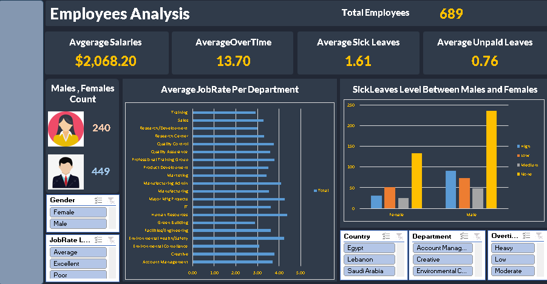

# Employees Analysis Dashboard (Excel)

## Overview

This project was developed as part of the **Data Analysis using AI
Training Program** provided by **Digital Hub** and **Orange Digital
Center**.

The goal of this project was to analyze employee data and build an
**interactive Excel dashboard** that provides insights into workforce
metrics such as salaries, overtime workload, job performance, and leave
patterns.

The dashboard enables dynamic filtering and visual exploration of
employee data across departments, countries, and gender.

------------------------------------------------------------------------

# Dataset

The dataset contains information about **689 employees** and includes
the following fields:

-   Employee ID / Number
-   First Name
-   Last Name
-   Gender
-   Start Date
-   Years of Experience
-   Department
-   Country
-   Center
-   Monthly Salary
-   Annual Salary
-   Job Rate
-   Sick Leaves
-   Unpaid Leaves
-   Overtime Hours

------------------------------------------------------------------------

# Data Preparation

The dataset was cleaned and transformed using **Power Query** in Excel.

Key preparation steps included:

-   Importing the dataset into a new workbook
-   Cleaning column formats
-   Ensuring numeric fields were properly typed
-   Preparing the dataset for **Pivot Table analysis**

Power Query was used to make the workflow **repeatable and structured**.

------------------------------------------------------------------------

# Dashboard Features

## KPI Metrics

The dashboard provides quick insights through KPI cards:

-   **Total Employees:** 689
-   **Average Salary:** \$2,068
-   **Average Overtime Hours:** 13.7
-   **Average Sick Leaves:** 1.61
-   **Average Unpaid Leaves:** 0.76

------------------------------------------------------------------------

## Visualizations

### Employee Distribution

Displays the count of **Male vs Female employees**.

### Job Rate by Department

A horizontal bar chart showing **average job performance rating per
department**.

### Sick Leave Comparison

A column chart comparing **sick leave levels between male and female
employees**.

------------------------------------------------------------------------

## Interactive Filters

The dashboard includes slicers that allow users to explore the data
dynamically:

-   **Country**
-   **Department**
-   **Overtime Level**
-   **Job Rate**
-   **Gender**

These filters allow the dashboard to update all visuals in real time.

------------------------------------------------------------------------

# Tools Used

-   Microsoft Excel
-   Power Query
-   Pivot Tables
-   Pivot Charts
-   Excel Slicers
-   Dashboard Design

------------------------------------------------------------------------

# Project Structure

    Employees-Analysis-Dashboard
    │
    ├── Data
    │   └── workshop_Employees.xlsx
    │
    ├── Dashboard
    │   └── Dashboard.xlsx
    │
    ├── Images
    │   └── dashboard-preview.png
    │
    └── README.md

------------------------------------------------------------------------

# Dashboard Preview

------------------------------------------------------------------------

# Learning Outcomes

Through this project, the following skills were practiced:

-   Data preparation using **Power Query**
-   Data analysis using **Pivot Tables**
-   Building **interactive dashboards in Excel**
-   Creating **KPI metrics**
-   Designing clear and structured **data visualizations**
