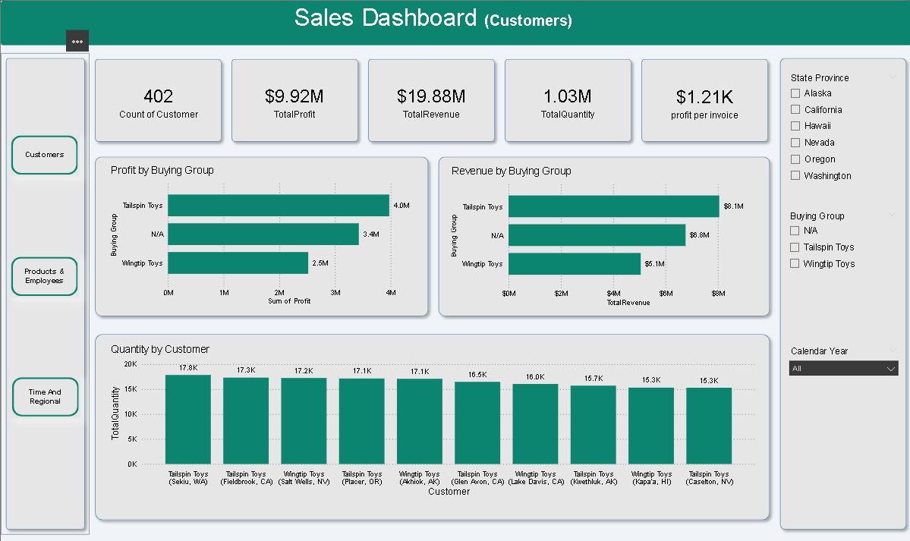
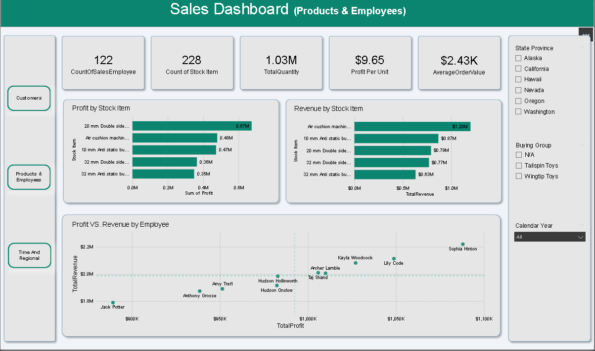
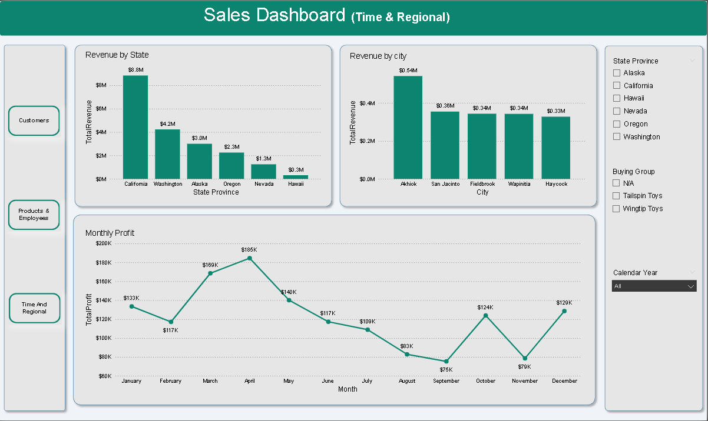

# Retail Sales Analytics Dashboard

## Project Overview

This project demonstrates an end-to-end data analytics workflow, from raw dataset preparation to building an interactive business intelligence dashboard.

The goal of the project was to explore sales performance across customers, products, employees, and geographic regions while showcasing core BI development skills such as data cleaning, data modeling, exploratory analysis, and dashboard design.

The final output is a multi-page interactive dashboard built in Power BI.

---

## Dataset

The dataset contains transactional sales data and multiple dimension tables representing:

* Customers
* Products (Stock Items)
* Employees
* Cities and Regions
* Calendar Dates

The structure follows a **star schema** where a central **FactSales** table is connected to several dimension tables.

---

## Data Preparation

Data preparation was performed using Excel Power Query.

Key steps included:

* Correcting data types across all tables
* Handling missing values and inconsistent formats
* Cleaning numeric fields (such as price columns containing special characters)
* Removing unnecessary lineage and validity columns
* Ensuring relationships between fact and dimension tables

The cleaned dataset was then loaded into a data model suitable for analytics.

---

## Data Model

A **star schema** was implemented with:

Fact Table

* FactSales

Dimension Tables

* DimCustomer
* DimStockItem
* DimEmployee
* DimCity
* DimDate

This structure enables efficient analysis and supports scalable BI reporting.

---

## Exploratory Data Analysis (EDA)

Initial analysis was conducted using pivot tables to identify:

* Revenue and profit trends
* Top customers and products
* Employee sales performance
* Geographic revenue distribution
* Monthly sales patterns

This exploratory step helped guide the design of the final dashboard.

---

## Dashboard Pages

The Power BI report contains three main analytical sections:

### 1. Customer Insights

Focuses on customer segmentation and purchasing behavior.

Key visuals include:

* Revenue and profit by buying group
* Top customers by quantity purchased
* Customer KPIs (total customers, revenue, profit, quantity)

---

### 2. Products & Employees

Analyzes product performance and employee sales efficiency.

Key visuals include:

* Top products by profit
* Top products by quantity sold
* Profit contribution by employee
* Revenue vs Profit scatter analysis for employee performance

---

### 3. Time & Regional Analysis

Explores temporal and geographic sales patterns.

Key visuals include:

* Monthly profit trend
* Revenue by state
* Top cities by revenue

---

## Key Metrics Created

Several calculated measures were created to support analysis:

* Total Revenue
* Total Profit
* Total Quantity
* Profit Margin
* Average Order Value
* Profit per Unit

---

## Tools Used

* Excel (Power Query for data cleaning)
* Power BI for data modeling and dashboard development

---

## Screenshots

*()*
*()*
*()*

---

## Key Skills Demonstrated

* Data cleaning and transformation
* Dimensional data modeling (star schema)
* Exploratory data analysis
* Business intelligence dashboard design
* KPI and metric development
