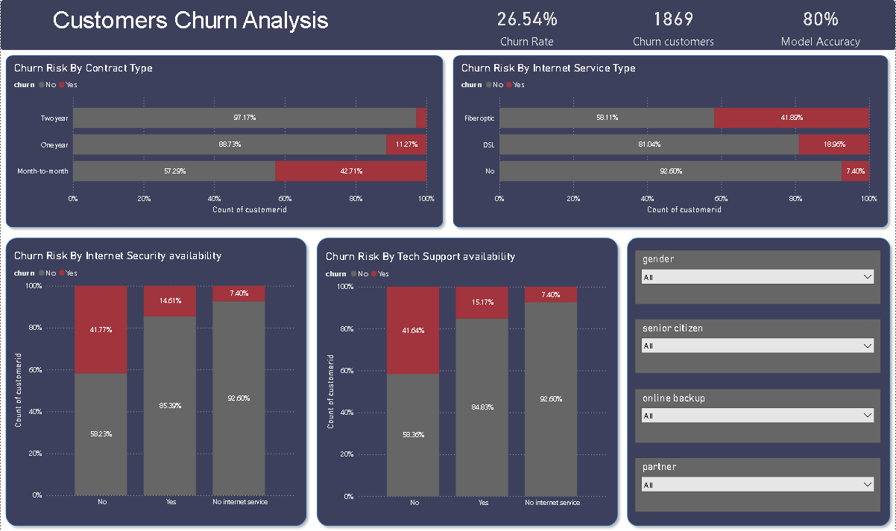

# 📊 Telecom Customer Churn Analysis & Prediction

## 📌 Overview

This project analyzes customer churn behavior in a telecom company and builds a machine learning model to predict customer attrition.

The objective is to identify key churn drivers and provide actionable insights to improve customer retention using both data analysis and predictive modeling.

---

## 🎯 Objectives

* Analyze customer churn patterns across different segments
* Identify key factors influencing churn
* Build a machine learning model to predict churn
* Deliver insights through an interactive Power BI dashboard

---

## 🛠️ Tech Stack

* **Python** (Data Analysis & Machine Learning)
* **Pandas & NumPy** (Data Manipulation)
* **Matplotlib & Seaborn** (Data Visualization)
* **Scikit-learn** (Model Building)
* **Power BI** (Dashboard & Business Intelligence)

---

## 📂 Dataset

* Source: **Kaggle – Telco Customer Churn Dataset**
* Records: **7,043 customers**
* Features: **21 columns** including demographics, services, and billing data

---

## 🔄 Project Workflow

### 1. Data Cleaning & Preprocessing

* Converted `TotalCharges` from object to numeric
* Handled missing/invalid values (empty strings)
* Verified no duplicate records
* Ensured dataset consistency and data types

---

### 2. Exploratory Data Analysis (EDA)

* Analyzed churn distribution across key variables:

  * Contract type
  * Internet service type
  * Customer support services
* Identified patterns and correlations affecting churn

---

### 3. Feature Engineering

* Encoded categorical variables for model compatibility
* Selected relevant features for prediction

---

### 4. Machine Learning Model

* Built a classification model to predict customer churn
* Evaluated performance using accuracy metric

---

### 5. Dashboard Development (Power BI)

* Designed an interactive dashboard to visualize:

  * Churn rate (26.5%)
  * Customer segments
  * Key churn drivers
* Enabled filtering by demographics and services

---

## 📈 Key Insights

* 📉 **Contract Type Impact**

  * Month-to-month customers show the highest churn (~42%)
  * Long-term contracts significantly reduce churn

* 🌐 **Internet Service**

  * Fiber optic users have the highest churn (~41%)
  * Indicates potential pricing or service quality issues

* 🔐 **Customer Support & Security**

  * Customers without tech support or security are **~3x more likely to churn**
  * These services strongly improve retention

---

## 🤖 Model Performance

* Achieved approximately **80% accuracy**
* Provides a strong baseline for churn prediction

---

## 📊 Dashboard Preview

*()*

---

## 💡 Business Recommendations

* Encourage long-term contracts through incentives
* Improve fiber optic service quality or pricing strategy
* Promote tech support and security add-ons
* Use predictive model to target high-risk customers

---

## 🚀 Future Improvements

* Improve model performance using advanced algorithms
* Deploy model as an API
* Build automated data pipeline (ETL)
* Integrate real-time analytics

---

